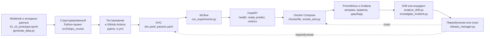

# Фонд оценочных средств по дисциплине «MLOps и инженерия жизненного цикла ML-систем»

> Статус: технически проверенная рабочая версия. Разработаны четыре модуля, девять тестов, девять лабораторных работ, четыре рубежные защиты, сквозной проект и регламент индивидуальной защиты. Формулировки и уровни сверены с включённой актуальной книгой КРМ 3.0. Модель лицензирования согласована авторским коллективом.

Репозиторий предназначен для открытого и воспроизводимого представления рабочей программы дисциплины, модели измерения результатов обучения, контрольно-измерительных материалов, критериев оценивания, методических рекомендаций и образовательных ресурсов.

## Версии репозитория

Ветка `main` представляет полную экспертно-преподавательскую версию комплексного ФОС. Она предназначена для рассмотрения, тиражирования и подготовки дисциплины преподавателем.

Ветка [`student`](https://github.com/TimurTKO/fos-mlops-mtuci/tree/student) представляет демонстрационную студенческую поставку: без ключей ответов, эталонных решений и закрытых преподавательских материалов.

При фактическом проведении дисциплины преподаватель создаёт собственную копию репозитория и адаптирует студенческую поставку под инфраструктуру и правила образовательной организации.

Репозиторий является публичным, поэтому ветка `student` не ограничивает доступ к ветке `main`: это демонстрация рекомендуемого состава выдачи, а не техническое средство разграничения доступа. Перечень материалов, не включаемых в студенческую поставку, приведён в [`.student-exclude`](.student-exclude); соответствие поставки этому перечню проверяется скриптом [`tools/check_student_delivery.py`](tools/check_student_delivery.py).

## Лицензирование

Лицензирование согласовано авторским коллективом.

Учебно-методические материалы предоставляются на условиях CC BY 4.0, оригинальный программный код — на условиях MIT License. Сторонние материалы сохраняют собственный правовой режим. Подробнее: [`LICENSE.md`](LICENSE.md).

Состав авторского коллектива — [`NOTICE.md`](NOTICE.md). Перечень сторонних материалов — [`THIRD_PARTY_NOTICES.md`](THIRD_PARTY_NOTICES.md).

## Быстрая навигация

- [Рабочая программа и исходные документы](docs/README.md)
- [Модель измерения](docs/measurement-model.md)
- [Компетенции и роли КРМ](data/README.md)
- [Модуль 1. Инженерная подготовка и тестирование](M1-engineering-testing/README.md)
- [Модуль 2. Воспроизводимость, данные и эксперименты](M2-reproducibility-experiments/README.md)
- [Модуль 3. Контейнеризация и развёртывание](M3-deployment/README.md)
- [Модуль 4. Мониторинг и инциденты](M4-monitoring-incidents/README.md)
- [Сквозной проект](Project/README.md)
- [Промежуточная аттестация: зачёт](Exam/README.md)
- [Протокол индивидуальной защиты](Exam/individual-defense-protocol.md)
- [Чек-лист сдачи проекта](Project/submission-checklist.md)
- [Методические указания](methodical-guidelines/README.md)
- [Образовательные ресурсы](resources/README.md)
- [Короткие тесты](resources/test-banks/README.md)
- [Базовый ML-проект](resources/starter-project/project-baseline/README.md)
- [Команда](team/README.md)
- [Контроль качества](docs/quality-checklist.md)
- [Ответ на замечания кросс-валидации](docs/cross-validation-response.md)
- [Правовой режим материалов](LICENSE.md)

## 1. О дисциплине

**Цель** — сформировать способность проектировать и реализовывать воспроизводимый жизненный цикл ML-системы: от исследовательского прототипа до тестируемого, версионируемого, контейнеризированного и наблюдаемого сервиса с управляемым обновлением и реагированием на инциденты.

**Структура:** 4 модуля, 9 лекций, 9 лабораторных работ, 4 рубежные защиты и единый сквозной проект. Общая трудоёмкость — 3 зачётные единицы (108 часов). Форма промежуточной аттестации — зачёт с защитой проекта.

**Пререквизиты:** Python, основы ML/DL и метрик, Git, Linux/CLI, базовое понимание REST API.

## 2. Планируемые результаты

Обучающийся сможет:

- создать воспроизводимый структурированный ML-проект;
- разработать автоматические проверки кода, данных, модели и API;
- связать версии кода, данных, конфигураций, экспериментов и модели;
- развернуть модель как контейнеризированный API-сервис;
- выполнить безопасное обновление и откат;
- настроить Prometheus/Grafana и анализ drift;
- диагностировать деградацию или инцидент и документировать восстановление.

## 3. Система оценивания

- короткие тесты №1–9 — 9 баллов;
- лабораторные работы №1–9 — 45 баллов;
- рубежные защиты №1–4 — 24 балла;
- защита сквозного проекта — 22 балла.

Итого — 100 баллов. Для зачёта необходимо выполнить и защитить все лабораторные работы, представить проект, пройти индивидуальную защиту и набрать не менее 71 балла.

## 4. Техническое ядро

[`resources/starter-project/project-baseline`](resources/starter-project/project-baseline/README.md) содержит воспроизводимый учебный проект: генератор данных, модель, тесты, CI, DVC, MLflow, FastAPI, Docker Compose, выпуск/откат, Prometheus, Grafana, drift-анализ и расследование инцидентов.

### 4.1. Архитектура сквозного проекта

Роль элементов:

- **Notebook и исходные данные** — исследовательский прототип и воспроизводимый генератор синтетического датасета с контрактом данных; отправная точка ЛР1.
- **Структурированный Python-проект** — разделение загрузки и проверки данных, обучения, инференса и API по модулям `src/mlops_course`.
- **Тестирование и GitHub Actions** — проверки кода, данных, модели и API, выполняемые локально и в CI; неуспешная проверка блокирует изменение.
- **DVC** — граф воспроизводимого пайплайна и версии данных, параметров и модели.
- **MLflow** — трекинг экспериментов, сравнение запусков и обоснованный выбор модели по заранее объявленному quality gate.
- **FastAPI** — сервис инференса с health-, readiness- и метрик-endpoint и валидацией входных данных.
- **Docker Compose** — переносимый запуск сервиса, healthcheck, smoke-проверка и управляемый выпуск версии.
- **Prometheus и Grafana** — сбор технических и ML-метрик, правила сигналов и дашборд наблюдаемости.
- **Drift или инцидент** — сценарии сдвига распределения, деградации качества и нарушения контракта данных с диагностическими отчётами.
- **Переобучение или откат** — соразмерная реакция: возврат к стабильной версии либо новый цикл обучения с повторной проверкой quality gate.

### 4.2. Что получает студент на старте

Материалы, доступные обучающемуся до начала выполнения лабораторных работ:

| Материал | Расположение |
|---|---|
| Исходный ноутбук с прототипом модели | [`notebooks/01_ml_prototype.ipynb`](resources/starter-project/project-baseline/notebooks/01_ml_prototype.ipynb) |
| Генератор синтетического датасета | [`resources/datasets/generate_data.py`](resources/datasets/generate_data.py) |
| Сформированные версии данных и сценарии инцидентов | [`resources/datasets/README.md`](resources/datasets/README.md) |
| Контракт данных | [`resources/datasets/data_contract.json`](resources/datasets/data_contract.json) |
| Базовая модель `LogisticRegression` в составе прототипа | [`notebooks/01_ml_prototype.ipynb`](resources/starter-project/project-baseline/notebooks/01_ml_prototype.ipynb) |
| Каркас Python-проекта и структура `src/tests/configs` | [`resources/starter-project/project-baseline/README.md`](resources/starter-project/project-baseline/README.md) |
| Требования к API: `/health`, `/ready`, `/predict`, `/docs` | [`kim-06-api-compose.md`](M3-deployment/kim-06-api-compose.md) |
| Конфигурационные шаблоны параметров и окружения | [`params.yaml`](resources/starter-project/project-baseline/params.yaml), [`.env.example`](resources/starter-project/project-baseline/.env.example) |
| Задания девяти лабораторных работ | [`M1`](M1-engineering-testing/README.md), [`M2`](M2-reproducibility-experiments/README.md), [`M3`](M3-deployment/README.md), [`M4`](M4-monitoring-incidents/README.md) |
| Критерии оценивания и рубрики | [`rubric-module-1.md`](M1-engineering-testing/rubric-module-1.md), [`rubric-module-2.md`](M2-reproducibility-experiments/rubric-module-2.md), [`rubric-module-3.md`](M3-deployment/rubric-module-3.md), [`rubric-module-4.md`](M4-monitoring-incidents/rubric-module-4.md), [`Exam/README.md`](Exam/README.md) |
| Шаблоны отчётов, прослеживаемости, постмортема и политики выпуска | [`resources/templates/README.md`](resources/templates/README.md) |
| Короткие тесты №1–9 без ключа | [`resources/test-banks/README.md`](resources/test-banks/README.md) |
| Методические указания обучающимся | [`methodical-guidelines/students/README.md`](methodical-guidelines/students/README.md) |

В ветке `main` перечисленные материалы соседствуют с преподавательскими: ключом к тестам, банками вопросов и живых изменений и полной эталонной реализацией учебного проекта. В ветке `student` преподавательские материалы исключены, а реализации учебного проекта заменены каркасом с `TODO` при сохранении структуры и интерфейсов.

## 5. Сквозной проект и защита

Итоговый проект проверяет полный жизненный цикл ML-системы. Перед защитой фиксируется Git SHA/тег, заполняются чек-лист сдачи и декларация использования ИИ. Индивидуальная защита включает воспроизводимую демонстрацию, вопросы по основной и смежной зонам и небольшое живое изменение.

## 6. Правила использования генеративного ИИ

ИИ допускается для объяснения ошибок и подготовки черновиков кода, тестов и документации при обязательном указании способа использования. Обучающийся отвечает за работоспособность, безопасность и понимание результата.
